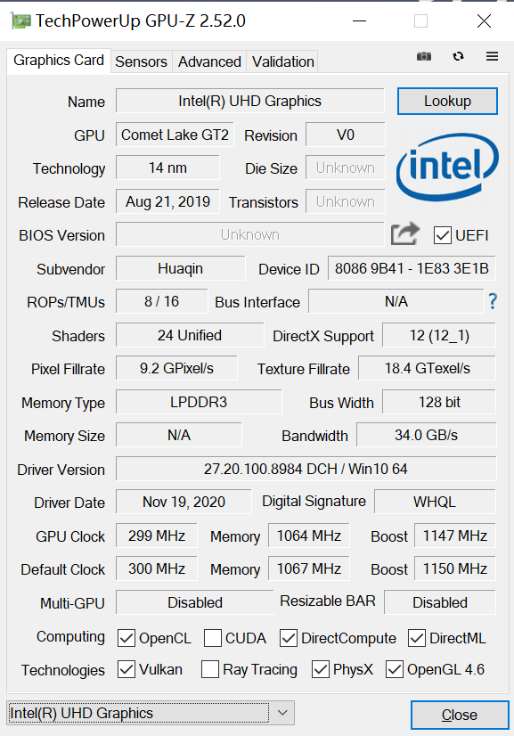
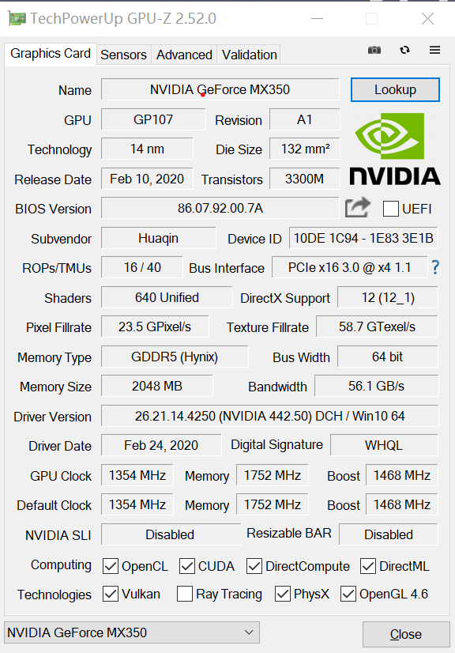
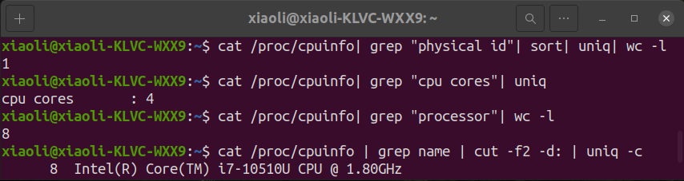
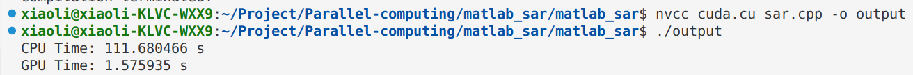
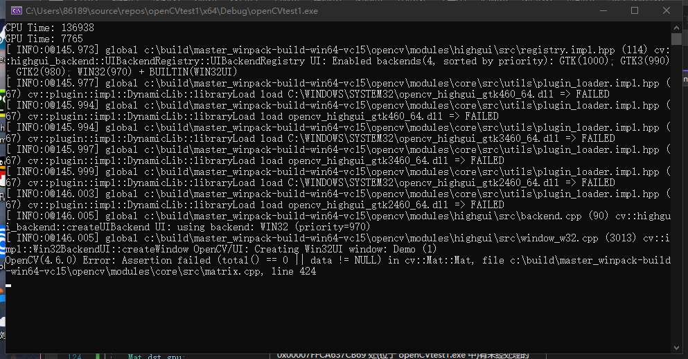
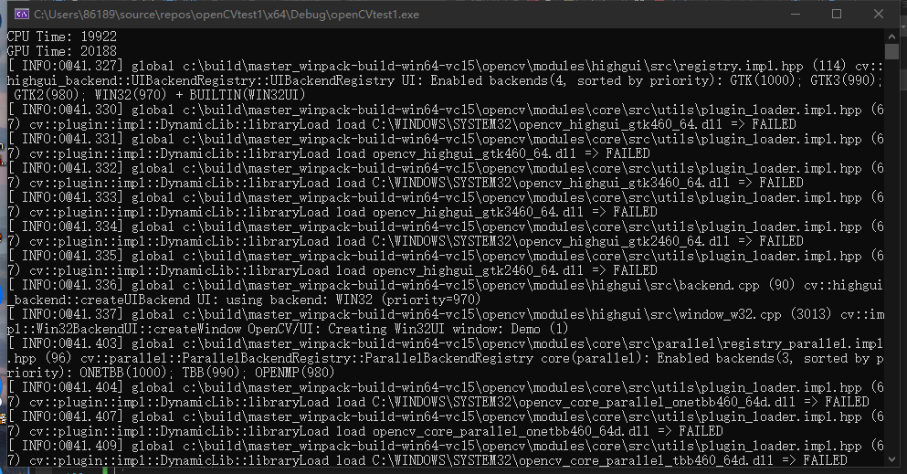
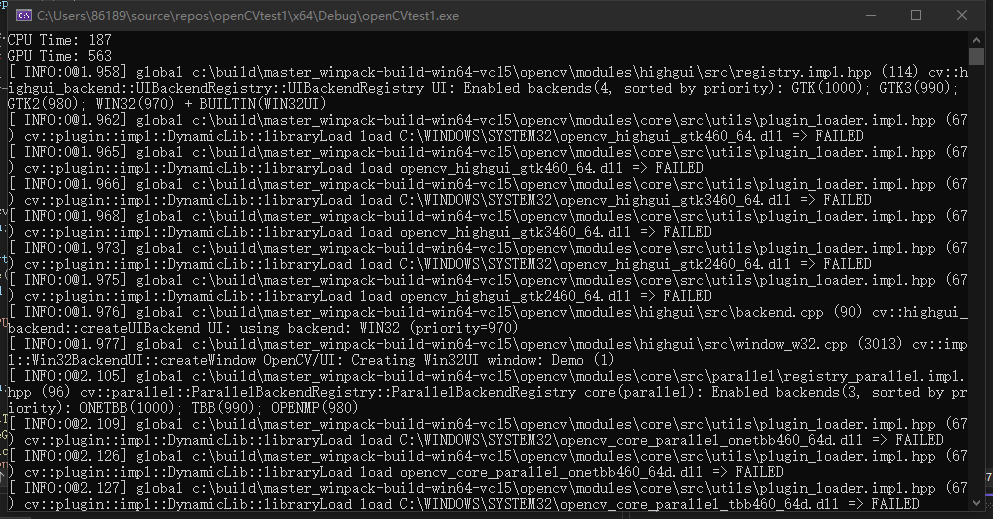
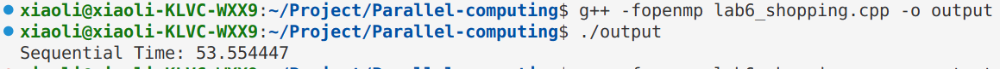
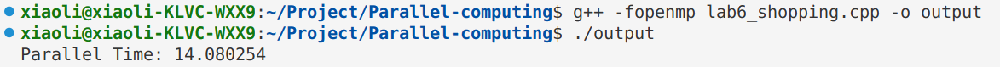

# Parallel Computing - PB20000178李笑

## 电脑配置
在实验`lab1`中我们已经将 MPI,OpenMP,CUDA 配置完成，这里仅简略列出电脑的主要参数。





## 雷达信号处理的 CUDA 优化
### Introduction:
雷达信号处理是指对雷达接收到的信号进行处理和分析的过程。雷达系统通过向目标发射一定频率的电磁波，接收由目标反射回来的信号，通过对接收到的信号进行处理，可以获取目标的位置、速度、形状等信息。雷达信号处理是这一过程中必不可少的环节，其主要任务是从原始的接收信号中提取有用信息，进行信号分析和处理，以得到目标的位置、速度、形态等相关参数。雷达信号处理包括数据预处理、信号分析、目标检测和跟踪等步骤，广泛应用于军事、航空、海洋等领域。

由于军事监测高精度的技术需求和自动驾驶技术的发展，近年来雷达信号处理的需求也变的越来越多，雷达信号处理也越来越复杂，同时对处理时间的要求也越来越严苛，只通过 cpu 很难满足性能要求，因此并行度高的 gpu 在雷达信号处理中逐渐成为主力军。在这个实验中我们使用 CUDA 对串行的雷达信号处理程序进行优化。

CUDA（Compute Unified Device Architecture），是显卡厂商NVIDIA推出的运算平台。 CUDA™是一种由NVIDIA推出的通用并行计算架构，该架构使GPU能够解决复杂的计算问题。 它包含了CUDA指令集架构（ISA）以及GPU内部的并行计算引擎。 开发人员可以使用C语言来为CUDA™架构编写程序，所编写出的程序可以在支持CUDA™的处理器上以超高性能运行。

### Code Description:
雷达信号处理的 CPU 实现：
```C++
for (int i = 0; i < Na; i++) {
	for (int j = 0; j < Nr; j++) {		
		float sum_re = 0.0f;
		float sum_im = 0.0f;
		for (int k = 0; k < 32; k++) {
			for (int m = 0; m < 32; m++) {
				float tav = (vr *ta[32 * k + m] - Az[i]);
				float Rt = sqrt(tav *tav + Rg[j] * Rg[j] + H*H);

				float tau = 2 * Rt / c;
				int nr = std::min(round((tau - trs_min)*Fr*L) ,(float)L*(int)Nfast);

				int y = m + 32 * k;
				int x = nr -1;

				float rd_re = SAR2[(y *(int)(Nfast*L) + x) * 2];
				float rd_im = SAR2[(y *(int)(Nfast*L) + x) * 2 + 1];

				float a = 4 * pi*fc / c*Rt;
				//cos(a) + sin(a);
				//exp(1j * 4 * pi*fc / c*Rt);
				//rd(m) = SAR2(m + Mslow / 32 * (k - 1), nr(m));

				sum_re += rd_re *cos(a) - rd_im *sin(a);
				sum_im += rd_re *sin(a) + rd_im *cos(a);

			}
		}
		SAR4[2 * (i * Na + j)] = sum_re;
		SAR4[2 * (i * Na + j)+ 1] = sum_im;	
	}
}
```
我们把雷达信号分成 $32 \times 32$ 的块进行处理，CPU 串行需要处理四层 for 循环，循环进行 $Na\times Nr\times 32\times32$ 次。

这段代码实现的是雷达信号处理的过程。主要目的是通过SAR（合成孔径雷达）成像技术将一系列的雷达回波信号转化为图像。具体的实现步骤如下：

1. 使用三层循环遍历每个像素点，其中 i 和 j 分别代表像素点在水平和垂直方向上的索引，k 和 m 分别代表 SAR 算法中的 k 和 m 参数。
2. 计算目标与雷达之间的距离 Rt，其中 Az[i] 代表水平方向上的偏移角度，Rg[j] 代表垂直方向上的偏移距离。
3. 根据 Rt 计算目标的回波时间延迟 τ，并将其转换为采样数 nr。
4. 通过查找 SAR2 数组中相应位置的值，得到雷达回波信号的实部和虚部值 rd_re 和 rd_im。
5. 计算雷达回波信号的相位，其中 a 表示雷达回波信号的相位差。
6. 将每个像素点的实部和虚部值 sum_re 和 sum_im 进行累加，并存储到 SAR4 数组中。
7. 最终生成的 SAR 图像保存在 SAR4 数组中。

需要注意的是，上述代码中的一些参数和变量需要根据实际应用情况进行设置和调整，例如Na代表图像在水平方向上的像素数，Nr代表图像在垂直方向上的像素数，ta数组存储了雷达回波信号的时域数据等。

雷达信号处理的 GPU 实现：
```C++
#define HANDLE_ERROR(err) (HandleError(err, __FILE__, __LINE__))
static void HandleError(cudaError_t err, const char* file, int line) {
	if (err != cudaSuccess) {
		fprintf(stderr, "Error %d: \"%s\" in %s at line %d\n", int(err), cudaGetErrorString(err), file, line);
		exit(int(err));
	}
}

extern "C" void generate_vec_gpu(float *SAR2, float  * ta, float * Az, float *Rg, float *SAR4,
	float vr, float H, float fc, float c, float trs_min,
	float Fr, float L, float NFast,
	int Na , int fL ,int mL)
{
	//dim3 blockSize(128);
	//dim3 gridSize((imgH * imgW + blockSize.x - 1) / blockSize.x);

	int in_width = fL * 8;
	int in_height = mL;
	int in_size = in_width *in_height * 8;
	float * dev_SAR2, *dev_ta ,*dev_Az , *dev_Rg, *dev_SAR4;
	HANDLE_ERROR(cudaMalloc((void**)&dev_SAR2, in_size));
	HANDLE_ERROR(cudaMalloc((void**)&dev_ta, sizeof(float) * fL));

	HANDLE_ERROR(cudaMalloc((void**)&dev_Az, sizeof(float) * Na));
	HANDLE_ERROR(cudaMalloc((void**)&dev_Rg, sizeof(float) * Na));
	HANDLE_ERROR(cudaMalloc((void**)&dev_SAR4, Na *Na *8));

	HANDLE_ERROR(cudaMemcpy(dev_SAR2, SAR2, in_size, cudaMemcpyHostToDevice));
	HANDLE_ERROR(cudaMemcpy(dev_ta, ta, sizeof(float) * fL, cudaMemcpyHostToDevice));
	HANDLE_ERROR(cudaMemcpy(dev_Az, Az, sizeof(float) * Na, cudaMemcpyHostToDevice));
	HANDLE_ERROR(cudaMemcpy(dev_Rg, Rg, sizeof(float) * Na, cudaMemcpyHostToDevice));

	cudaEvent_t start1;
	cudaEventCreate(&start1);	// 创建事件，用于记录时间
	cudaEvent_t stop1;
	cudaEventCreate(&stop1);
	cudaEventRecord(start1, NULL);

	dim3 blockSize1(32, 32, 1);		// 设置并发格式
	dim3 gridSize1((Na + blockSize1.x - 1) / blockSize1.x, (Na + blockSize1.y - 1) / blockSize1.y, (1 + blockSize1.z - 1) / blockSize1.z);
	//printf("gridSize =%d %d %d   blockSize =%d %d %d\n", gridSize1.x , gridSize1.y, gridSize1.z, blockSize1.x, blockSize1.y, blockSize1.z);
	generate_SAR4_kernel << <gridSize1, blockSize1 >> > (dev_SAR2, dev_ta, dev_Az, dev_Rg, dev_SAR4,
		vr, H, fc,  c,  trs_min, Fr,  L,  NFast, Na);
	cudaEventRecord(stop1, NULL);	// 记录
	cudaEventSynchronize(stop1);	// 同步
	float msecTotal1 = 0.0f;
	cudaEventElapsedTime(&msecTotal1, start1, stop1);
	// std::cout << "generate_vec_gpu :" << msecTotal1 << std::endl;

	HANDLE_ERROR(cudaMemcpy(SAR4, dev_SAR4, Na *Na * 8, cudaMemcpyDeviceToHost));	// 检测 CUDA 函数的返回值，若出现错误会输出相应的错误信息

	cudaFree(dev_SAR2);	// 释放 GPU 内存空间
	cudaFree(dev_ta);
	cudaFree(dev_Az);
	cudaFree(dev_Rg);
	cudaFree(dev_SAR4);
}
```
处理步骤：  
1. 首先，使用 cudamalloc 分配 GPU 内存
2. 将输入数据从 CPU 拷贝到 GPU，使用函数 cudamemcpy 实现
3. 设置 CUDA 每次并发的线程数，这里设置的是 $32\times32$，每次并发的核为1024，相当于一次处理1024个单元
4. 通过 generate_SAR4_kernel 函数调用 GPU 内核函数，实现对雷达信号的并行计算。这个函数使用了 CUDA的并行计算机制，将每个线程分配给一个像素点的处理，计算出对应的信号值并存储到输出数组中
```C++
__global__ void generate_SAR4_kernel(float *SAR2 ,float  * ta, float * Az, float *Rg,float *SAR4,
									float vr, float H,  float fc, float c,float trs_min,
									float Fr, float L, float Nfast,
									int Na ) {
	
	int j = blockIdx.x * blockDim.x + threadIdx.x;
	int i = blockIdx.y * blockDim.y + threadIdx.y;
	// int z = blockIdx.z * blockDim.z + threadIdx.z;
	if (i >= Na || j >= Na) {
		return;
	}
	float sum_re = 0.0f;
	float sum_im = 0.0f;
	for (int k = 0; k < 32; k++) {
		for (int m = 0; m < 32; m++) {
			float tav = (vr *ta[32 * k + m] - Az[i]);
			float Rt = sqrt(tav *tav + Rg[j] * Rg[j] + H*H);

			float tau = 2 * Rt / c;
			int nr = (round((tau - trs_min)*Fr*L));
			nr = nr < (int)L*(int)Nfast ? nr : (int)L*(int)Nfast;
			int y = m + 32 * k;
			int x = nr - 1;
			float rd_re = SAR2[(y *(int)(Nfast*L) + x) * 2];
			float rd_im = SAR2[(y *(int)(Nfast*L) + x) * 2 + 1];
			float a = 4 * M_PI*fc / c*Rt;
			sum_re += rd_re *cos(a) - rd_im *sin(a);
			sum_im += rd_re *sin(a) + rd_im *cos(a);

		}
	}
	SAR4[2 * (i * Na + j)] = sum_re;
	SAR4[2 * (i * Na + j) + 1] = sum_im;
}
```
kernel 函数是指每个线程 id 执行的运算，i 和 j 代表线程 id 号，每次并发 $32\times 32$。

5. 统计 GPU kernel 运行时间，使用 cudaEventElapsedtime 用来获取 GPU 耗时事件
6. 将 GPU 处理后的数据搬回 CPU，使用 cudamemcpy，方向是 device2host
7. 使用 cudaFree 函数释放 GPU 内存空间

### Code Running:
```bash
nvcc cuda.cu sar.cpp -o output
./output
```

### Results and Analysis:
输出结果为


计算得加速比为 70.87。

### Conclusion:
通过 GPU 和 CPU 的耗时比较，我们发现 GPU 在并行计算中优势明显。虽然比起其他同学加速比一百多的加速比我的优化效果略微逊色，但是我的项目更偏向于工业界，具有实际作用。可以想象，在军事和自动驾驶领域，如果雷达检测延时大，其后果不可设想，所以我认为我做的这个项目是有重要意义的，同时在之后我也会从更多方面来优化程序，进一步提高算法的加速比。

## 图像缩放的 CUDA 优化
### Introduction:
首先我解释一下为什么有两个 CUDA 优化的代码。这个项目相较于前一个项目比较简单，是因为前一个项目花费了大量时间，中间也遇到了一些设计和环境配置上的困难，临近 ddl 时担心不能顺利跑通所以写了这个程序来保证完成任务。幸运的是在大作业截止日期的前一天我成功跑通了雷达信号处理的代码，于是将两个程序都附在了报告中。

图像缩放是图像处理中非常重要的一个环节。使用 CUDA 优化图像缩放的根本目的是加速图像处理。由于 CUDA 可以利用 GPU 的并行计算能力，因此可以在处理大量数据时提高计算速度。在图像缩放中，需要对每个像素进行计算，因此可以使用 CUDA 并行计算来加速这个过程。这样可以大大减少处理时间，提高图像处理效率。

### Code Description:
CPU 实现
```C++
void resizeImage(const Mat &_src, Mat &_dst, const Size &s )
{
	_dst = Mat::zeros(s, CV_8UC3);
	double fRows = s.height / (float)_src.rows;	// 行缩放因子
	double fCols = s.width / (float)_src.cols;	// 列缩放因子
	int pX = 0;
	int pY = 0;
	for (int i = 0; i != _dst.rows; ++i){	// i 遍历目标图像的行
		for (int j = 0; j != _dst.cols; ++j){	// j 遍历目标图像的列
			pX = cvRound(i/(double)fRows);	// 缩放后的 i 对应原图像的位置
			pY = cvRound(j/(double)fCols);	// 缩放后的 j 对应原图像的位置
			if (pX < _src.rows && pX >= 0 && pY < _src.cols && pY >= 0){
				// 对彩色图像的 RGB 三层分别处理
				_dst.at<Vec3b>(i, j)[0] = _src.at<Vec3b>(pX, pY)[0];
				_dst.at<Vec3b>(i, j)[1] = _src.at<Vec3b>(pX, pY)[1];
				_dst.at<Vec3b>(i, j)[2] = _src.at<Vec3b>(pX, pY)[2];
			}
		}
	}
}
```

GPU 实现
```C++
void resizeImageGpu(const Mat &_src, Mat &_dst, const Size &s)
{
	_dst = Mat(s, CV_8UC3);
	uchar *src_data = _src.data;
	int width = _src.cols;
	int height = _src.rows;
	uchar *src_dev , *dst_dev;
 
	cudaMalloc((void**)&src_dev, 3 * width*height * sizeof(uchar) );
	cudaMalloc((void**)&dst_dev, 3 * s.width * s.height * sizeof(uchar));
	cudaMemcpy(src_dev, src_data, 3 * width*height * sizeof(uchar), cudaMemcpyHostToDevice);
 
	double fRows = s.height / (float)_src.rows;
	double fCols = s.width / (float)_src.cols;
	int src_step = _src.step;
	int dst_step = _dst.step;
 
	dim3 grid(s.height, s.width);
	kernel << < grid, 1 >> >(src_dev, dst_dev, src_step, dst_step, height, width, s.height, s.width);
 
	cudaMemcpy(_dst.data, dst_dev, 3 * s.width * s.height * sizeof(uchar), cudaMemcpyDeviceToHost);
}

__global__ void kernel(uchar* _src_dev, uchar * _dst_dev, int _src_step, int _dst_step ,
	int _src_rows, int _src_cols, int _dst_rows, int _dst_cols)
{
	// 使用多 block 并行程序
	int i = blockIdx.x;
	int j = blockIdx.y;
 
	double fRows = _dst_rows / (float)_src_rows;
	double fCols = _dst_cols / (float)_src_cols;
 
	int pX = 0;
	int pY = 0;
 
	pX = (int)(i / fRows);
	pY = (int)(j / fCols);
	if (pX < _src_rows && pX >= 0 && pY < _src_cols && pY >= 0){
		*(_dst_dev + i*_dst_step + 3 * j + 0) = *(_src_dev + pX*_src_step + 3 * pY);
		*(_dst_dev + i*_dst_step + 3 * j + 1) = *(_src_dev + pX*_src_step + 3 * pY + 1);
		*(_dst_dev + i*_dst_step + 3 * j + 2) = *(_src_dev + pX*_src_step + 3 * pY + 2);
	
	}
 
}
```

### Results and Analysis:
输出结果为

计算得加速比为 17.64 。

当我们将放大倍数从 50 减为 20 时，输出为

计算得加速比为 0.97 。

当我们继续降低放大倍数到 2 时，输出为

计算得加速比为 0.33 。

在这种情况下，使用 GPU 反而会减慢处理速度，因为把数据从内存中复制到 GPU 所花费的时间比使用 GPU 节省的时间还要多。我们可以得出一个结论：当放大倍数较小(<20)时，使用 CPU 更节省时间；当放大倍数较大(>20)时，使用 GPU 更节省时间。


## 基于 KNN 的购物反馈预测的 OpenMP 优化
### Introduction:
KNN（K-Nearest Neighbors）是一种非参数的监督学习算法，主要用于分类和回归问题。KNN算法的核心思想是：当一个新样本需要分类时，找到离它最近的K个训练样本，根据它们的标签来预测新样本的类别或者回归值。

KNN算法的作用包括：

1. 分类：KNN可以用于分类问题，将新的未知数据点分配到最近邻居所属的类别中。这种方法可以应用于很多领域，例如文本分类、图像分类等。

2. 回归：KNN还可以用于回归问题，预测新数据点的值。在这种情况下，KNN使用与分类相同的方法来选择最近的邻居，但是不是预测新数据点的类别，而是预测它的数值。

3. 数据挖掘：KNN还可以用于聚类和异常检测等数据挖掘任务。在聚类中，KNN算法可以将数据点分成不同的群体。在异常检测中，KNN可以识别远离其他数据点的离群值。

KNN 算法可以用在图像识别、自然语言处理、推荐系统、数据挖掘等许多领域。

选择这个题目是受到上学期《机器学习》课程大作业的启发，课程主页[https://miralab.ai/course/ml_2022fall/](https://miralab.ai/course/ml_2022fall/)中有项目要求和数据集描述，由于提供的原始数据集数据量巨大
（87766*15，数据条数为87766条，特征空间为15维），而 knn 算法必须计算每个点与其他点之间的距离以求得最近 k 个点的 label 来预测自己的 label，这就导致运行完整个程序需要花费很多时间。因为距离计算之间相对独立，所以在这里我可以利用 OpenMP 并行很多循环处理和矩阵乘法操作，有效的降低了程序运行所需时间。

原始数据集`train_data_all.json`是从购物网站直接抓来，并没有进行数据清洗工作，所以有很多空白项和杂乱的数据，因此我们需要先对数据进行处理。我将数据处理部分放在`data_proc.py`文件中，knn 预测实现放在`kNN.py`文件中，整个处理和预测过程可以通过运行`pb20000178.py`文件来进行，并输出预测准确率。

为了测试的快捷性，我们只选取了预测的中间数据支持向量集（`Store_data.npy`大小为28904\*10，`Store_label.npy`大小为28904\*1，通过`transfer.py`将其拼接为一个大小为28904\*11的`support_data.txt`，最后一维是数据的label）来进行我们的实验，但是需要知道这个方法是可泛化的，而且随着数据量或近邻点数量 k 的增加，程序运行时间是多项式增加的。

### Code Description:
`lab6_shopping.cpp`中部分注释代码没有删去，其作用是输出中间信息，确保算法在并行前后都具有正确性。
```C++
#define NUM 28904 //总数据的数量
#define NUM1 5780 //测试数据的数量 28904*0.2 5780
#define NUM2 23124 //训练数据的数量 28904*0.8 23124
#define N 10 //特征数据的数量（维数）
#define KN 15//K的最大取值

typedef struct {
	double data;//距离
	char trainlabel;//用于链接训练标签

}Distance;

typedef struct {
	int data[N];
	int label;
}TestAndTrain;	// 数据存储结构

TestAndTrain test[NUM1];//测试数据结构体数组
TestAndTrain train[NUM2];//训练数据结构体数组
TestAndTrain temp[NUM]; //临时存放数据结构体数组
Distance distance[NUM2];//存放距离结构体数组

void makerand(TestAndTrain a[],int n){ //函数功能：打乱存放标签后的结构体数组
	TestAndTrain t;
	int i=0,n1,n2;
	srand((unsigned int)time(NULL));
	for(i=0;i<n;i++){
		n1 = (rand() % n);//产生n以内的随机数  n是数组元素个数
		n2 = (rand() % n);
		if(n1 != n2){ //若两随机数不相等 则下标为这两随机数的数组进行交换
			t = a[n1];
			a[n1] = a[n2];
			a[n2] = t;
		}
	}
	
}

void tempdata(char filename[]){//临时存放所有数据然后打乱
	FILE* fp = NULL;
	fp = fopen(filename, "r");
	int i=0,j=0;
	for(i=0;i<NUM;i++){
		for(j=0;j<N;j++){
			fscanf(fp ,"%d ",&temp[i].data[j]);
			fgetc(fp);
		}
		fscanf(fp, "%d",&temp[i].label);
	}

	makerand(temp,NUM);//打乱所有数据

	fclose(fp);
	fp = NULL;
}

void loaddata() { //加载数据      分割：测试NUM1组   训练NUM2组
	int i, j, n = 0, m = 0;
	for (i = 0; i < NUM; i++) {
		if (i < NUM1) { //存入测试集
			for (j = 0; j < N; j++) {
				// printf("i=%d  j=%d\n",i,j);
				test[n].data[j] = temp[i].data[j]; //存入花的四个特征数据
			}
			test[n].label = temp[i].label;//存入花的标签
			n++;
		}
		else { //剩下的行数存入训练集
			for (j = 0; j < N; j++) {
				train[m].data[j] = temp[i].data[j];//存入花的四个特征数据
			}
			train[m].label = temp[i].label;//存入花的标签
			m++;
		}
	}
}

double computedistance(int n1,int n2) { //计算距离
	double sum = 0.0;
	int i; int tid;
	int temp[10];
	for (i = 0; i < N; i++) {
		sum += pow(test[n1].data[i] - train[n2].data[i], 2.0);
	}
	return sqrt(sum);//返回距离
}

int max(int a, int b, int c) { //找出频数最高的 测试数据就属于出现次数最高的
	if(a>b && a>c) return 1;
	if(b>a && b>c) return 2;
	if(c>a && c>b) return 3;
	return 0;
}

void countlabel(int* sum ,int k, int n) { //统计距离最邻近的k个标签出现的频数
	int i;
	int sum1 = 0, sum2 = 0, sum3 = 0;
	for (i = 0; i < k; i++) {
		switch (distance[i].trainlabel) { //用Distance结构体指针p来取K个距离最近的标签来进行判断
			case 1:sum1++; break;
			case 2:sum2++; break;
			case 3:sum3++; break;
		}
	}
	if (max(sum1, sum2, sum3) == test[n].label) { //检测距离最近的k个标签与原测试标签是否符合  并统计
		(*sum)++; //统计符合的数量
	}
}

int cmp(const void* a, const void* b) { //快速排序qsort函数的cmp函数(判断函数)
	Distance A = *(Distance*)a;
	Distance B = *(Distance*)b;
	return A.data > B.data ? 1 : -1;
}

int main()
{
	omp_set_num_threads(8);
	double start_time, end_time;
    char filename[20]={"support_data.txt"};
	tempdata(filename);//加载临时数据->打乱数据
	loaddata();//加载打乱后的数据并分割
	int i, j;
	int k=KN; //k值
	int sum = 0;//用于统计距离最近的k个标签与原测试标签符合的数量

	start_time = omp_get_wtime();

	// 对每条测试数据与训练数据计算距离的过程进行并行
	#pragma omp parallel for
	for (i = 0; i < NUM1; i++) {
		#pragma omp parallel for
		for (j = 0; j < NUM2; j++) {
			// printf("i = %d    j = %d\n", i, j);
			distance[j].data = computedistance(i,j);//把计算好的距离依次存入distance结构体数组中
			distance[j].trainlabel = train[j].label; //以上距离存入的同时也把训练集标签一起存入distance结构体数组中
		}
		qsort(distance, NUM2, sizeof(distance[0]), cmp); //用qsort函数从小到大排序测试数据与每组训练数据的距离
		countlabel(&sum, k, i); //统计距离测试集标签最近的标签出现频数
	}
	end_time = omp_get_wtime();
	// printf("Sequential Time: %f\n", end_time-start_time);
	printf("Parallel Time: %f\n", end_time-start_time);
	// printf("K = %d     P = %.1lf%%\n", k,100.0*(sum)/NUM1);
	sum = 0;//每次统计完后都赋值0  便于下一个测试数据统计
	
	return 0;
}
```

### Code Running
```bash
g++ -fopenmp lab6_shopping.cpp -o output
./output
```

### Results and Analysis:
优化前串行时间：


优化后并行时间：


计算得加速比为3.8。

### Conclusion:
从最后的输出结果我们可以看出，openmp 并行显著降低了 knn 的计算时间，验证了我们最开始的猜想。
