# Parallel Computing B-PB20000178 李笑
## Lab 1 - OpenMP及CUDA实验环境的搭建

以下两张截图是我个人电脑的配置：


切换到`Ubuntu20.04`进行后续实验，通过命令行查看配置：


### 安装OpenMP
步骤：
1. 快捷键`Ctrl+Atl+T`打开终端
2. 在终端输入`sudo apt-get install libomp-dev`安装OpenMP
3. 在终端输入`sudo apt-get install gcc`安装GCC
4. 在终端输入`gcc --version`检查安装是否成功
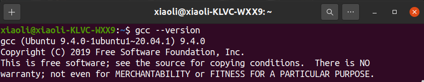
5. 在终端输入`echo |cpp -fopenmp -dM |grep -i open`检查OpenMP安装是否成功
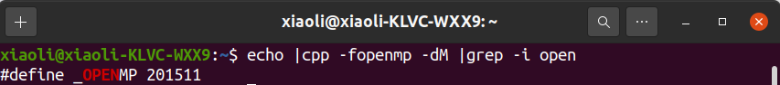


### 安装CUDA
配置前：
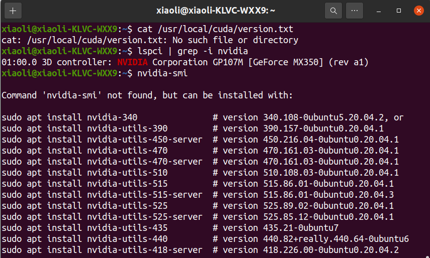
上图信息表明，我的电脑装有NVIDIA显卡，但是没有安装显卡驱动

步骤：
1. 手动安装显卡驱动。依次在终端输入，选择系统推荐版本驱动`nvidia-driver-525`

```
$ sudo add-apt-repository ppa:graphics-drivers/ppa
$ sudo apt update
$ ubuntu-drivers devices
$ sudo apt install nvidia-driver-525
```
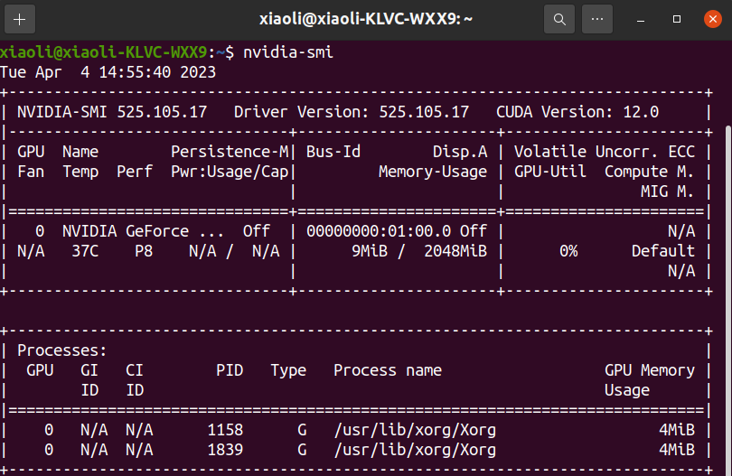
2. 关闭系统自带驱动`nouveau`。通过在终端输入指令`lsmod | grep nouveau`查看驱动启用情况。我输入后发现有输出，表明`nouveau`驱动正在工作。所以,接下来在终端输入`sudo gedit /etc/modprobe.d/blacklist.conf`，弹出了`blacklist.conf`文件，在文件末尾加上`blacklist nouveau`和`options nouveau modeset=0`两行并保存。
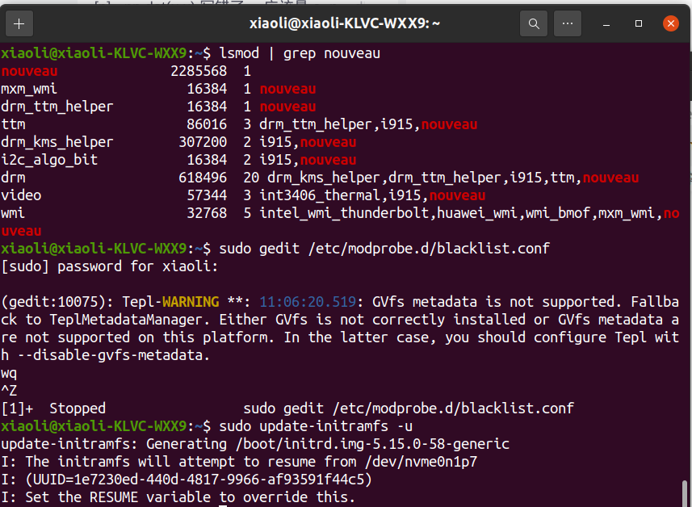
1. 重启
2. 进入NVIDIA官网CUDA下载页面`https://developer.nvidia.com/cuda-toolkit-archive`选择`CUDA Toolkit 11.2.0(December 2020)`，依次选择`Linux`→`x86_64`→`Ubuntu`→`20.04`→`runfile(local)`
3. 在终端输入`sudo apt-get install freeglut3-dev build-essential libx11-dev libxmu-dev libxi-dev libgl1-mesa-glx libglu1-mesa libglu1-mesa-dev`安装依赖库文件
4. 在终端输入`wget https://developer.download.nvidia.com/compute/cuda/11.2.0/local_installers/cuda_11.2.0_460.27.04_linux.run`和`sudo sh cuda_11.2.0_460.27.04_linux.run`安装CUDA。接下来会弹出两个页面，在第一个页面输入`accept`、回车，在第二个页面按空格取消`Driver`勾选，然后点击`Install`、等待。
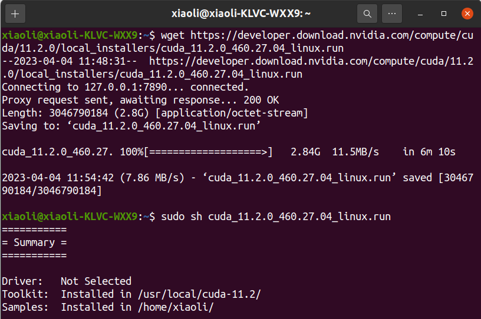
5. 配置环境变量
```
$ export PATH=/usr/local/cuda-10.1/bin${PATH:+:${PATH}}
$ export LD_LIBRARY_PATH=/usr/local/cuda-10.1/lib64\
                         ${LD_LIBRARY_PATH:+:${LD_LIBRARY_PATH}}
```
6. 在终端输入`source ~/.bashrc`使环境变量生效。
7. 查看CUDA安装信息
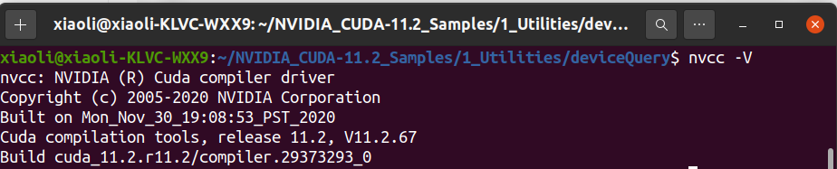
8. CUDA测试。进入NVIDIA CUDA示例包，其位于`/home/xiaoli/NVIDIA_CUDA-11.2_Samples`，在该文件夹下打开终端，并输入`make`。然后进入`1_Utilities/deviceQuery`文件夹，并在终端执行`./deviceQuery`命令，输出结果`result=PASS`表示安装成功。
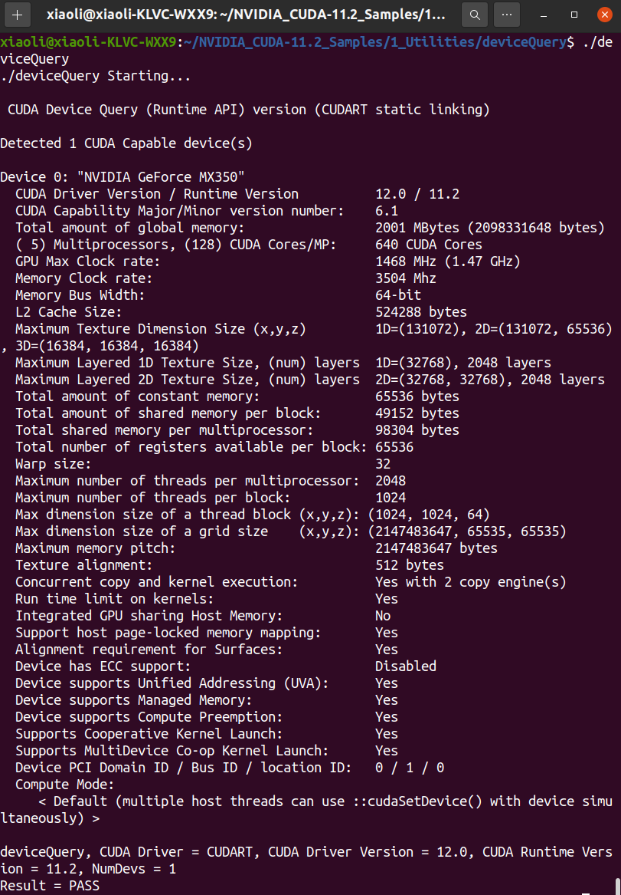


## Lab 2 - 排序算法的并行及优化（验证）
### OpenMP
在这个实验中我们对一个10000维的数组进行归并排序，数组通过`(double) rand() / RAND_MAX`进行随机初始化。根据我们先前学过的归并算法写出归并排序的非并行版本，并可以从中发现归并排序具有显然的并行条件——每次递归划分为两个数组，我们可以将两个数组放在不同cpu上运行以实现并行效果。


为达到上述目的，我们首先在主函数中加入`omp_set_num_threads(8)`用来设定我们需要使用的线程数（这里设定为8因为我的设备是4核8线程），其次我们`merge_sort()`函数中加入
```C
// Sort the left and right halves in parallel
#pragma omp parallel sections
{
   #pragma omp section
   merge_sort(arr, l, m);
   
   #pragma omp section
   merge_sort(arr, m + 1, r);
}
```
这里使用的是事件并行，具有内含的同步等待功能。

最后，我们在主函数中并行测试部分加入
```C
// Parallel merge sort
start_time = omp_get_wtime();
#pragma omp parallel
{
    #pragma omp single
    merge_sort(arr, 0, n - 1);
}
end_time = omp_get_wtime();
```
用来保证`merge_sort()`只由单个线程执行。

输出结果为
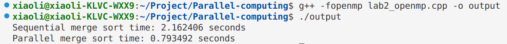

计算得加速比为 3.11 。

### Cuda


## Lab 3 - 矩阵乘法的并行及优化（验证）
### OpenMP
同样，我们使用随机函数来初始化我们的矩阵，代码如下
```C
void genMat(float* arr, int n)
{
	int i, j;

	for (i = 0; i < n; i++)
	{
		for (j = 0; j < n; j++)
		{
			arr[i * n + j] = (float)rand() / RAND_MAX + (float)rand() / (RAND_MAX);
		}
	}
}
```

分别定义串行矩阵乘法`matMultCPU_serial()`和并行矩阵乘法`matMultCPU_parallel()`函数。并行矩阵乘法函数如下：
```C
static void matMultCPU_parallel(const float* a, const float* b, float* c, int n)
{
#pragma omp parallel for schedule(dynamic)
	for (int i = 0; i < n; i++)
	{
		for (int j = 0; j < n; j++)
		{
			double t = 0;
			for (int k = 0; k < n; k++)
			{
				t += (double)a[i * n + k] * b[k * n + j];
			}
			c[i * n + j] = t;
		}
	}
}
```
我们在for循环前加了openmp指令`#pragma omp parallel for schedule(dynamic)`，使得操作系统能自动根据cpu负载来调度线程并行运行。

输出结果为
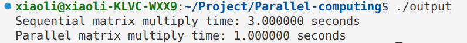

计算得加速比为 3 。

### Cuda

## Lab 4 - 快速傅里叶变换的并行实现（验证）
傅里叶变换常用于加速多项式乘法，而常规的快速傅里叶变换（原理略）通常是使用递归实现的，使用并行优化的难度比较高。因此，我在这里实现了非迭代的快速傅里叶版本：先预处理每个位置上元素变换后的位置（每个位置分治后的最终位置为其二进制翻转后得到的位置），然后先将所有元素移到变换后的位置之后直接循环合并。

找变换位置这里其实有一个经典算法叫雷德算法，又被称作蝴蝶变换；不过我没有使用这一算法，因为蝴蝶变换有一定的循环依赖性，很难并行优化。

随后，调整完循环顺序后，第一层循环变量 i 表示每一层变换的跨度，第二层循环变量 j 表示每一层变换的一个起点，第三层循环遍历表示实际变换的位置 k 和 k+i。在这里，从第二层开始是没有循环依赖的，即对不同的 j ，算法不会对同一块地址进行访问（因为访问的下标 $k\equiv j(mod i)$且$k+i\equiv j(mod i)$）。

为公平起见，用作对比的串行版本快速傅里叶变换是直接在并行版本上删去编译推导 `#pragma omp for` 得到的。这是因为递归版本的快速傅里叶变换通常有较大的函数递归开销。

为方便测试不同线程数与不同输入长度对应的串、并行消耗时间，我们在程序中加入运行参数设置部分——第一个参数是并行部分使用的线程数量，第二个参数是需要做快速傅里叶变换的数组长度的指数（例，输入为 n 表示数组长度为 $2^n$）。
）

输出结果为
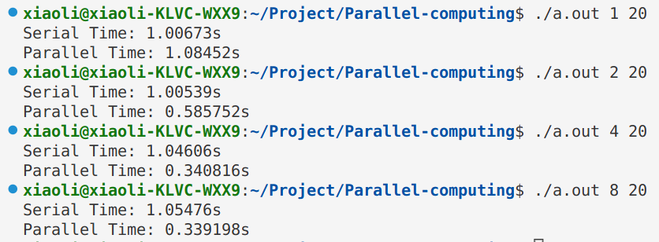
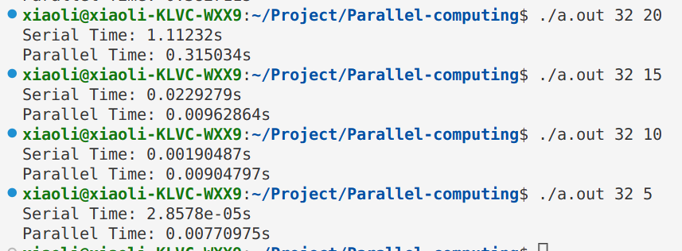

根据上述结果我们可以列出表格：

当输入数组的长度固定为 $2^{20}$ 时，
| 线程数 | 1 | 2 | 4 | 8 |
|-------|---|---|---|---|
|串行时间|1.00673|1.00539|1.04606|1.05476|
|并行时间|1.08425|0.585752|0.340816|0.339198|
|加速比|0.9|1.7|3.1|3.1|

当并发线程数固定为 32 时，
| 数组长度n | 20 | 15 | 10 | 5 |
|-------|---|---|---|---|
|串行时间|1.11232|0.229279|0.00190487|2.8578e-5|
|并行时间|0.315034|0.00962863|0.00904797|0.0770975|
|加速比|3.6|2.4|0.2|0.0|

根据表格中所填数据，我们发现最大加速比为 3.6 ，此时并发线程数设置为 32 ，输入数组长度为 $2^{20}$。


## Lab 5 - 常用图像处理算法的并行及优化（设计）
### OpenMP


### Cuda


## Appendix
仅以此记录一下自己被困扰了一天的问题。以下是我写的第一个测试OpenMP的C语言代码

```C
#include <stdio.h>
#include <time.h>
#include <omp.h>

void sum(){
    int sum = 0;
    for(int i = 0; i < 100000000; i++){
        sum++;
    }
}

void parallel(){
    clock_t start, end;
    start = clock();
    # pragma omp parallel for
    for(int i = 0; i < 100; i++){
        sum();
    }
    end = clock();
    printf("Parallel time: %ld \n", end - start);
}

void no_parallel(){
    clock_t start, end;
    start = clock();
    for(int i = 0; i < 100; i++){
        sum();
    }
    end = clock();
    printf("Serial time: %ld \n", end - start);
}

int main() {
    parallel();
    no_parallel();
    return 0;
}
```

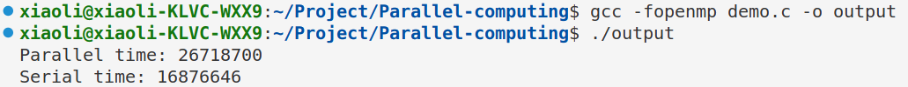

但是输出结果却令我大为震惊，因为开了并行竟然比不开更浪费时间，虽然我一开始以为可能是老师上课说的那种情况——并行的开销比并行的收益更大，但是当我把参数量调大之后发现这个现象仍然存在，于是我上网进行了搜索，终于发现原来是时间的测量方法使用错误。`clock()`记录的是CPU的滴答数，当并行多个进程同时计算，CPU滴答数成倍增加，所以我们得到的差值并不是真实的时间数，OpenMP提供的`omp_get_wtime()`才记录的是真实的运行时间，当我把所有时间测量函数从`clock()`修改为`omp_get_wtime()`后发现代码运行正常，结果如下
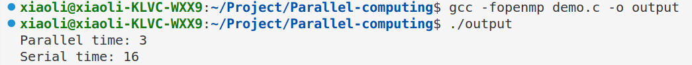
