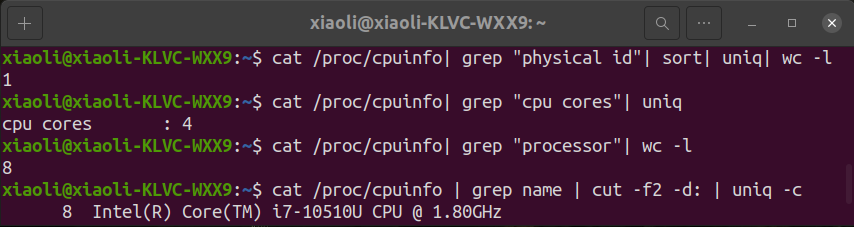

# Parallel Computing B-PB20000178 李笑
## Lab 1 - OpenMP及CUDA实验环境的搭建
我的电脑配置了双系统 —— Windows 10 和 Ubuntu 20.04。 Windows 系统中有太多开机自启动项以及 Ubuntu 的 Linux 内核小量轻便、具有更高的使用权限等种种因素决定在接下来的实验中我将会在 Ubuntu 系统中完成。在课程结束后，我也会将代码开源在我的[GitHub](https://github.com/Deborah-x/Parallel-computing)。

### Windows
以下两张截图是我个人电脑的配置：


### Ubuntu 20.04
在`Ubuntu20.04`环境中，我们可以通过命令行查看配置：


#### 配置MPI
1. 在[OpenMPI](http://www.open-mpi.org)官网下载最新的 `.tar.gz` 压缩包

2. 创建一个新的目录用来放置OpenMPI的安装包然后进入它
```bash
$ mkdir $HOME/openmpi
$ cd $HOME/openmpi
```

3. 将 `.tar.gz` 文件复制到我们创建的文件夹下
```bash
$ cp $HOME/Downloads/openmpi-4.1.5.tar.gz $HOME/openmpi
```

4. 解压缩然后进入 openmpi-4.1.5 文件夹下
```bash
$ tar -xzvf openmpi-4.1.5.tar.gz
$ cd openmpi-4.1.5
```

5. 配置和编译
```bash
$ ./configure --prefix=$HOME/openmpi
$ make all
```

6. 安装
```bash
$ make install
```

7. 将 OpenMPI 添加到我们的 PATH 和 LD_LIBRARY_PATH 环境变量中

#### 配置OpenMP
步骤：
1. 快捷键`Ctrl+Atl+T`打开终端
2. 在终端输入`sudo apt-get install libomp-dev`安装OpenMP
3. 在终端输入`sudo apt-get install gcc`安装GCC
4. 在终端输入`gcc --version`检查安装是否成功

5. 在终端输入`echo |cpp -fopenmp -dM |grep -i open`检查OpenMP安装是否成功


#### 配置OpenCV
按照[如何在 Ubuntu 20.04 上安装 OpenCV](https://cloud.tencent.com/developer/article/1657529)配置即可。

配置完成后查看是否配置成功（版本号）：


#### 配置CUDA
配置前：

上图信息表明，我的电脑装有NVIDIA显卡，但是没有安装显卡驱动

步骤：
1. 手动安装显卡驱动。依次在终端输入，选择系统推荐版本驱动`nvidia-driver-525`

```
$ sudo add-apt-repository ppa:graphics-drivers/ppa
$ sudo apt update
$ ubuntu-drivers devices
$ sudo apt install nvidia-driver-525
```

2. 关闭系统自带驱动`nouveau`。通过在终端输入指令`lsmod | grep nouveau`查看驱动启用情况。我输入后发现有输出，表明`nouveau`驱动正在工作。所以,接下来在终端输入`sudo gedit /etc/modprobe.d/blacklist.conf`，弹出了`blacklist.conf`文件，在文件末尾加上`blacklist nouveau`和`options nouveau modeset=0`两行并保存。

1. 重启
2. 进入NVIDIA官网CUDA下载页面`https://developer.nvidia.com/cuda-toolkit-archive`选择`CUDA Toolkit 11.2.0(December 2020)`，依次选择`Linux`→`x86_64`→`Ubuntu`→`20.04`→`runfile(local)`
3. 在终端输入`sudo apt-get install freeglut3-dev build-essential libx11-dev libxmu-dev libxi-dev libgl1-mesa-glx libglu1-mesa libglu1-mesa-dev`安装依赖库文件
4. 在终端输入`wget https://developer.download.nvidia.com/compute/cuda/11.2.0/local_installers/cuda_11.2.0_460.27.04_linux.run`和`sudo sh cuda_11.2.0_460.27.04_linux.run`安装CUDA。接下来会弹出两个页面，在第一个页面输入`accept`、回车，在第二个页面按空格取消`Driver`勾选，然后点击`Install`、等待。

5. 配置环境变量
```
$ export PATH=/usr/local/cuda-10.1/bin${PATH:+:${PATH}}
$ export LD_LIBRARY_PATH=/usr/local/cuda-10.1/lib64\
                         ${LD_LIBRARY_PATH:+:${LD_LIBRARY_PATH}}
```
6. 在终端输入`source ~/.bashrc`使环境变量生效。
7. 查看CUDA安装信息

8. CUDA测试。进入NVIDIA CUDA示例包，其位于`/home/xiaoli/NVIDIA_CUDA-11.2_Samples`，在该文件夹下打开终端，并输入`make`。然后进入`1_Utilities/deviceQuery`文件夹，并在终端执行`./deviceQuery`命令，输出结果`result=PASS`表示安装成功。


## Lab 2 - 排序算法的并行及优化（验证）
### OpenMP
在这个实验中我们对一个 10000000 维的 int 型数组进行归并排序，数组通过`rand()`进行随机初始化。根据我们先前学过的归并算法写出归并排序的非并行版本，并可以从中发现归并排序具有显然的并行条件——每次递归划分为两个数组，我们可以将两个数组放在不同cpu上运行以实现并行效果。

为达到上述目的，我们首先在主函数中加入`omp_set_num_threads(8)`用来设定我们需要使用的线程数（这里设定为8因为我的设备是4核8线程）。然后我们再想办法对 `merge_sort()` 的递归并行处理。显然我们可以将 `merge_sort()` 中两次递归直接用 `#pragma omp sections` 进行并行，但每次启动线程会消耗大量的常数时间，在 low 和 high 相差很小的时候，并行递归的开销远大于串行递归。于是我们对并行版本的快速排序进行优化，使用 if 判断，只有当 `high-low>dx` 时才并行递归，否则直接串行递归。

```C++
void parallel_merge_sort(int* a, int low, int high) {
    if (low >= high)
        return;
    int mid = (low + high) / 2;
    int dx = 1000;
    if (high - low > dx) {
        parallel_merge_sort(a, low, mid);
        parallel_merge_sort(a, mid + 1, high);
    }
    else {
        merge_sort(a, low, mid);
        merge_sort(a, mid + 1, high);
    }
    merge(a, low, mid, high);
}
```

接下来我们需要实现 `merge()` 函数的并行版本。并行归并算法有许多种，比较著名的有Valiant的并行归并算法、Cole的并行归并排序算法。其基本思想都是采取一定方法，将两个有序序列分解成若干个成对的段（这种成对的段叫段组），然后将每个段组都归并好，归并好的各段组自然连成了一个有序序列。

在此基础上，我们的算法流程如下：
1. 确定两组数据的数量，分别记为 n1 和 n2;
2. 准备折半查找, l = 0, r = n1;
3. 确定第一组数据的枢轴位置 pos1 = (l + r) / 2;(若l <= r则退出)
4. 在第二组数据中，使用折半查找方法找到对应的枢轴 pos2;(具体流程略，时间复杂度 O(logN))
5. 如果分割得到的第一段数据规模比第二段数据规模小，则 l = pos1 + 1，回到3;(pos1向后调整)
6. 如果分割得到的第一段数据规模比第二段数据规模大，则 r = pos1 - 1，回到3;(pos1向前调整)

查找枢轴的实现代码如下：
```C++
int seek_pos[MAX_THREADS + 1][3] = {}, n1 = mid - low + 1, n2 = high - mid;
    for (int i = 1; i < MAX_THREADS; i++) {//找第i个枢轴
        int l1 = low, r1 = mid, pos1 = mid, pos2 = high;
        while (r1 - l1 > 0) {
            pos1 = (l1 + r1) / 2;//折半查找，先假定第一组数据的枢轴
            int l2 = mid + 1, r2 = high + 1;
            while (r2 - l2 > 0) {//再用折半查找确定第二组的枢轴
                pos2 = (l2 + r2) / 2;
                if (a[pos1] <= a[pos2]) 
                    r2 = pos2;
                else 
                    l2 = pos2 + 1;
            }
            pos2 = r2;
            if ((pos1 + pos2 - low - mid) * MAX_THREADS < (n1 + n2) * i) 
                l1 = pos1 + 1;
            else 
                r1 = pos1 - 1;
        }
        seek_pos[i][1] = pos1;//将枢轴位置记录到数组中
        seek_pos[i][2] = pos2;
        seek_pos[i][0] = seek_pos[i][1] + seek_pos[i][2] - low - mid - 1;//输出枢轴位置
    }
    //边界条件
    seek_pos[0][1] = low;
    seek_pos[0][2] = mid + 1;
    seek_pos[0][0] = seek_pos[0][1] + seek_pos[0][2] - low - mid - 1;
    seek_pos[MAX_THREADS][1] = mid + 1;
    seek_pos[MAX_THREADS][2] = high + 1;
    seek_pos[MAX_THREADS][0] = seek_pos[MAX_THREADS][1] + seek_pos[MAX_THREADS][2] - low - mid - 1;
```
上述代码中， `seek_pos[][]` 数组记录了各对枢轴的位置。（如果计划启动4个线程，则需要查找3对枢轴，将原数据等分4份）其中， `seek_pos[x][1]` 记录了第一组数据的第x个枢轴， `seek_pos[x][2]` 记录了第二组数据的第x个枢轴， `seek_pos[x][0]` 记录了即将归并得到的有序序列（即下面代码中的 `temp[]` 数组）中的第x个枢轴。

接下来便是并行归并操作，将归并的结果暂存到 `temp[]` 数组中：
```C++
int* temp = new int[high - low + 1];
parallel_for(0, MAX_THREADS, [&](int x) {
    int i = seek_pos[x][1], j = seek_pos[x][2], k = seek_pos[x][0];
    while (i < seek_pos[x + 1][1] && j < seek_pos[x + 1][2])
        if (a[i] < a[j])
            temp[k++] = a[i++];
        else
            temp[k++] = a[j++];
    while (i < seek_pos[x + 1][1]) temp[k++] = a[i++];
    while (j < seek_pos[x + 1][2]) temp[k++] = a[j++];
});
```

所有的线程都完成了归并操作后，将 `temp[]` 数组中的内容拷贝回原数组中对应的位置，则完成了对 `arr[]` 数组 `[low, high]` 区域的归并：
```C++
parallel_for(0, MAX_THREADS, [&](int x) {
    for (int i = seek_pos[x][0]; i < seek_pos[x + 1][0]; i++)
        a[low + i] = temp[i];
});
delete[] temp;
```

将上述代码片段拼在一起，便得到了并行归并的函数 `parallel_merge()`。

在数据规模较小时，由于寻找枢轴、启动线程的开销相对较大，并行归并的运行效率甚至不及串行归并。当数据规模极大，使得寻找枢轴、启动线程的开销可以忽略的情况下，并行归并能获得比较可观的加速效果。这里我们为了方便测试选取的数组长度只有 10000000。

输出结果为


计算得加速比为 2.73 。

### Cuda
Cuda 程序执行的处理流程：
1. 分配内存空间和显存空间
2. 初始化内存空间
3. 将要计算的数据从 Host 内存复制到 GPU 内存上
4. 执行 Kernel 计算
5. 将计算后 GPU 内存上的数据复制到 Host 内存上
6. 处理复制到 Host 内存上的数据


## Lab 3 - 矩阵乘法的并行及优化（验证）
### OpenMP
同样，我们使用随机函数来初始化我们的矩阵，代码如下
```C
void genMat(float* arr, int n)
{
	int i, j;

	for (i = 0; i < n; i++)
	{
		for (j = 0; j < n; j++)
		{
			arr[i * n + j] = (float)rand() / RAND_MAX + (float)rand() / (RAND_MAX);
		}
	}
}
```

分别定义串行矩阵乘法`matMultCPU_serial()`和并行矩阵乘法`matMultCPU_parallel()`函数。并行矩阵乘法函数如下：
```C
static void matMultCPU_parallel(const float* a, const float* b, float* c, int n)
{
#pragma omp parallel for schedule(dynamic)
	for (int i = 0; i < n; i++)
	{
		for (int j = 0; j < n; j++)
		{
			double t = 0;
			for (int k = 0; k < n; k++)
			{
				t += (double)a[i * n + k] * b[k * n + j];
			}
			c[i * n + j] = t;
		}
	}
}
```
我们在for循环前加了openmp指令`#pragma omp parallel for schedule(dynamic)`，使得操作系统能自动根据cpu负载来调度线程并行运行。

输出结果为


计算得加速比为 3 。

### Cuda

## Lab 4 - 快速傅里叶变换的并行实现（验证）
傅里叶变换常用于加速多项式乘法，而常规的快速傅里叶变换（原理略）通常是使用递归实现的，使用并行优化的难度比较高。因此，我在这里实现了非迭代的快速傅里叶版本：先预处理每个位置上元素变换后的位置（每个位置分治后的最终位置为其二进制翻转后得到的位置），然后先将所有元素移到变换后的位置之后直接循环合并。

找变换位置这里其实有一个经典算法叫雷德算法，又被称作蝴蝶变换；不过我没有使用这一算法，因为蝴蝶变换有一定的循环依赖性，很难并行优化。

随后，调整完循环顺序后，第一层循环变量 i 表示每一层变换的跨度，第二层循环变量 j 表示每一层变换的一个起点，第三层循环遍历表示实际变换的位置 k 和 k+i。在这里，从第二层开始是没有循环依赖的，即对不同的 j ，算法不会对同一块地址进行访问（因为访问的下标 $k\equiv j(mod i)$且$k+i\equiv j(mod i)$）。

为公平起见，用作对比的串行版本快速傅里叶变换是直接在并行版本上删去编译推导 `#pragma omp for` 得到的。这是因为递归版本的快速傅里叶变换通常有较大的函数递归开销。

为方便测试不同线程数与不同输入长度对应的串、并行消耗时间，我们在程序中加入运行参数设置部分——第一个参数是并行部分使用的线程数量，第二个参数是需要做快速傅里叶变换的数组长度的指数（例，输入为 n 表示数组长度为 $2^n$）。
）

输出结果为


根据上述结果我们可以列出表格：

当输入数组的长度固定为 $2^{20}$ 时，
| 线程数 | 1 | 2 | 4 | 8 |
|-------|---|---|---|---|
|串行时间|1.00673|1.00539|1.04606|1.05476|
|并行时间|1.08425|0.585752|0.340816|0.339198|
|加速比|0.9|1.7|3.1|3.1|

当并发线程数固定为 32 时，
| 数组长度n | 20 | 15 | 10 | 5 |
|-------|---|---|---|---|
|串行时间|1.11232|0.229279|0.00190487|2.8578e-5|
|并行时间|0.315034|0.00962863|0.00904797|0.0770975|
|加速比|3.6|2.4|0.2|0.0|

根据表格中所填数据，我们发现最大加速比为 3.6 ，此时并发线程数设置为 32 ，输入数组长度为 $2^{20}$。


## Lab 5 - 常用图像处理算法的并行及优化（设计）
### OpenMP
在这个实验中我们实现的是图像的边缘检测算法。

下面简单介绍一下我们使用的 Kirsch 算子——它是 R.Kirsch 于1971 年提出的一种能检测边缘方向的方法，使用了8个模板来确定梯度幅度值和梯度的方向，如下图所示：


图片中的每个点都用8个掩模进行卷积，每个掩模对某个特定边缘方向做出最大相应。所有8个方向中的最大值作为边缘幅度图像的输出。最大响应掩模的序号构成了边缘方向的编码。显然，其8个独立的掩模具有很好的并行性（我们设置并行线程数为8）。具体实现如 `lab5_openmp.cpp`所示。

在代码中我们首先构造了8个全局掩模矩阵并按 Kirsch 方法初始化。我们选择处理的图片是数字图像处理中最经典的图Lena。

在图像的处理过程中，我们采用任务并行：
```C++
#pragma omp parallel sections
{
  #pragma omp section
  {
      filter2D(image_gray, image_bw1, -1, kernel1); 
      convertScaleAbs(image_bw1, image_bw1);  
  }
  #pragma omp section
  {
      filter2D(image_gray, image_bw2, -1, kernel2); 
      convertScaleAbs(image_bw2, image_bw2); 
  }
  #pragma omp section
  {
    ...
  }
  ...
}
```
给每个卷积核分配到一个section中，整体的sections能保证所有部分的section能在进行完毕之后等待同步。

之后还需要找到每个像素所有8个方向中的最大值作为该像素边缘幅度图像的输出。我们看到遍历每个像素的过程有双重for循环，因此可以使用for循环的并行，同时加上2层坍缩。
```C++
#pragma omp parallel for shared(i, j) collapse(2)
	for (i = 0; i < image_gray.rows; i++)
	{
		for (j = 0; j < image_gray.cols; j++)
		{
			int arr[] = {image_bw1.at<uchar>(i, j), image_bw2.at<uchar>(i, j)
				, image_bw3.at<uchar>(i, j), image_bw4.at<uchar>(i, j), image_bw5.at<uchar>(i, j)
				, image_bw6.at<uchar>(i, j), image_bw7.at<uchar>(i, j), image_bw8.at<uchar>(i, j)};
			int max_num = *max_element(arr, arr + 8);
			image_bw.at<uchar>(i, j) = max_num;
		}
	}
```

在代码中我们输出了部分中间图像和串、并行的结果图像，以验证算法实现的正确性，最后为了避免图像输出所花时间对算法总运行时间的影响，我们在代码中将图像的输出部分全部注释掉。

输出结果为


计算得加速比为 2.3 。

### Cuda

## Lab 6 - 还没想好


## Appendix
仅以此记录一下自己被困扰了一天的问题。以下是我写的第一个测试OpenMP的C语言代码

```C
#include <stdio.h>
#include <time.h>
#include <omp.h>

void sum(){
    int sum = 0;
    for(int i = 0; i < 100000000; i++){
        sum++;
    }
}

void parallel(){
    clock_t start, end;
    start = clock();
    # pragma omp parallel for
    for(int i = 0; i < 100; i++){
        sum();
    }
    end = clock();
    printf("Parallel time: %ld \n", end - start);
}

void no_parallel(){
    clock_t start, end;
    start = clock();
    for(int i = 0; i < 100; i++){
        sum();
    }
    end = clock();
    printf("Serial time: %ld \n", end - start);
}

int main() {
    parallel();
    no_parallel();
    return 0;
}
```


但是输出结果却令我大为震惊，因为开了并行竟然比不开更浪费时间，虽然我一开始以为可能是老师上课说的那种情况——并行的开销比并行的收益更大，但是当我把参数量调大之后发现这个现象仍然存在，于是我上网进行了搜索，终于发现原来是时间的测量方法使用错误。`clock()`记录的是CPU的滴答数，当并行多个进程同时计算，CPU滴答数成倍增加，所以我们得到的差值并不是真实的时间数，OpenMP提供的`omp_get_wtime()`才记录的是真实的运行时间，当我把所有时间测量函数从`clock()`修改为`omp_get_wtime()`后发现代码运行正常，结果如下

